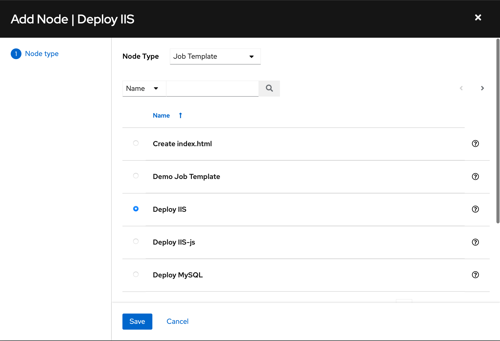
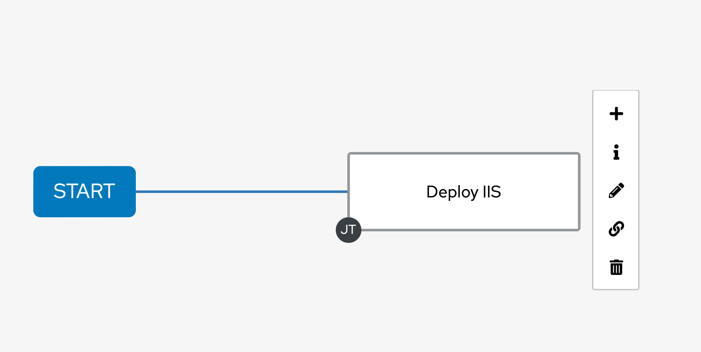
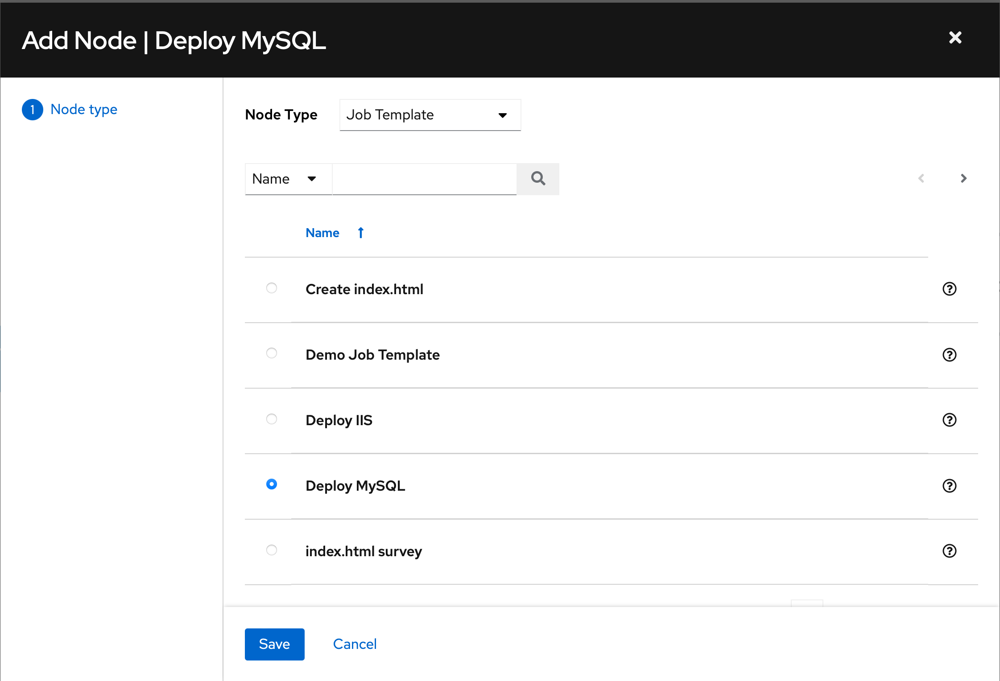
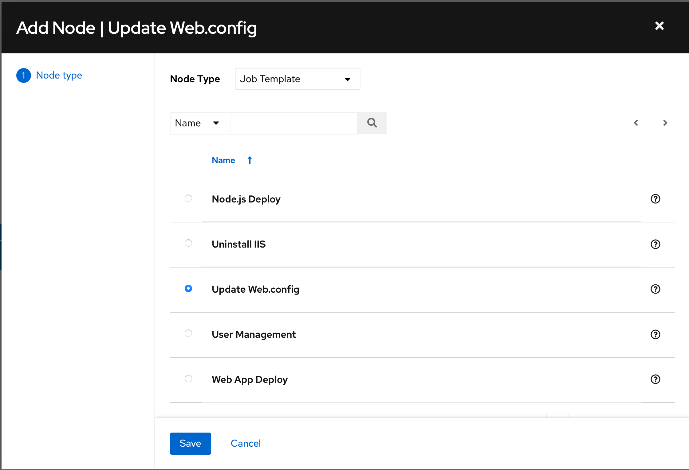

# AAP - Workflows


## Objective

The basic idea of a workflow is to link multiple Job Templates together. They may or may not share inventory, playbooks, or even permissions. The links can be conditional:

- Job Deploy IIS and Deploy MySQL run in parallel and if Deploy IIS Succeeds then Configure web.config runs.

And the workflows are not even limited to Job Templates, but can also include project or inventory updates.

This enables new applications for Ansible automation controller: different Job Templates can build upon each other. E.g. the networking team creates playbooks with their own content, in their own Git repository, and even targeting their own inventory, while the operations team also has their own repos, playbooks, and inventory.

In this lab, you’ll learn how to set up a workflow.

## Guide

### Lab scenario

You have two departments in your organization:

- The web operations team that is developing playbooks to deploy infrastructure for the development team who will deploy their application to the infrasture as they complete new versions

### Web operations team

- Install IIS, Install MySQL, Configure the web app to use the new MYSQL server by updating its web.config with the MySQL server details

### Create credentials for Linux server.
This lab deploys MySQL to our Ubuntu VM. To access it, we need to provide our private SSH key. 

In Putty, on the Ubuntu VM, run the following command: 

```bash
cat ~/.ssh/id_rsa
```

Copy the **complete private key** (including “BEGIN” and “END” lines) , and save it for the next step.

Now configure the credentials to access the managed hosts from Ansible Automation Platform.

In the **Resources** menu choose **Credentials**, and click **Add** then fill in the following:

- **Name**: linux
- **Description**: Credentials to authenticate over SSH
- **Organization**: Default
- **Credential Type**: Machine

Under **Type Details** fill in:

- **Username**: ubuntu
- **SSH Private Key**: Paste the private key from above.

**Privilege Escalation Method**: sudo

- Click **Save**

Go back to the **Resources -> Credentials -> Linux credentials** and note that the SSH key is not visible.

You have now set up credentials for Ansible to access your Ubuntu managed host.


### Add your Ansible host to the AAP Inventory

In the web UI menu on the left side, go to **Resources** → **Inventories**, choose **AAP Inventory**

Click **Edit** and **remove** the variables

```yaml
ansible_connection: winrm
ansible_winrm_transport: ntlm
ansible_winrm_server_cert_validation: ignore
```


At the top of the page click the **Hosts** button, and add our `ubuntu_server` host.

Click the **Add** button and give a **Name**, and **Description**:

- **Name**: `ubuntu_server`

- Under **Variables** confirm **YAML** is highlighted and then paste the following:

  ```
  ansible_host: <IP of Ubuntu node from spreadsheet> 
  ```

- Click **Save**


Test your new server by going to **Inventories** -> **AAP Inventory** -> **Hosts**, select the `ubuntu_server` and click **Run Command**. 

Select the **ping** module and launch it. 

If everything is successfull you will receive a `pong` from the Ubuntu server.


## Add variables to the Windows group

In **Inventories** -> **AAP Inventory**, click **Groups**, and select **windows**. 

Click **Edit** and **add** the following variables:

```yaml
ansible_connection: winrm
ansible_winrm_transport: ntlm
ansible_winrm_server_cert_validation: ignore
```


## Create playbooks 

In VS Code create the following: 

In the `ansible-working` repository, create a new folder `workflow` and inside of it create a file `deploy_iis.yml` with the following content:

```yaml
---
- name: Install IIS on Windows
  hosts: all
  become: yes
  become_method: runas
  become_user: Administrator
  tasks:
  - name: Install IIS Web Server Role
    win_feature:
      name: Web-Server
      state: present
  - name: Start World Wide Web Publishing Service
    win_service:
      name: W3SVC
      start_mode: auto
      state: started
  - name: Create index.html file
    win_copy:
      content: "<html><head><title>Workflow</title></head><body><h1>Hello, World!</h1><p>It Works!</p></body></html>"
      dest: "C:\\inetpub\\wwwroot\\index.html"
```

Inside of the `workflow` folder create another playbook named `install_mysql.yml`

```yaml
---
- name: Install MySQL
  hosts: all
  become: true
  tasks:
    - name: Install MySQL
      apt:
        name: mysql-server
        state: present
```


Inside of the `ansible-working` directory create a `web_deploy_workflow.yml` with: 

```yaml
- name: Update Web.Config for DB
  hosts: all
  become: yes
  become_method: runas
  become_user: Administrator
  roles:
    - create-web-config
```

Inside of the `create-web-config` -> `tasks` directory update `main.yml` with:

```jinja2
---
- name: create web.config file
  template:
    src: templates/web.config.j2
    dest: c:\inetpub\wwwroot\web.config
```

Confirm the `templates` `web.config.j2` file has the following: 

```jinja2
<?xml version="1.0" encoding="UTF-8"?>
<configuration>
  <appSettings>
  
    <add key="sqlConnectionString" value="Server={{ ip_address }};Database={{ database_name }};User ID={{ db_username }};Password={{ db_password }};"/>
  
  </appSettings>
</configuration>
```


Commit and push your changes to your repository.

**Remember to synchronize your project.**


### Set up job templates

Now you have to create two Job Templates like you would for “normal” Jobs.

Within **Resources** -> **Templates**, click the **Add** button and choose **Add job template**:

| Parameter             | Value                         |
| --------------------- | ----------------------------- |
| Name                  | Deploy IIS                    |
| Job Type              | Run                           |
| Inventory             | AAP Inventory                 |
| Project               | Ansible Workshop Examples     |
| Execution Environment | Default execution environment |
| Playbook              | `workflow/deploy_iis.yml`     |
| Credentials           | win_cred                      |
| Limit                 | windows                       |
| Options               | ✓ Privilege Escalation        |

Click **Save**

------

This template targets our new Linux server. 

We must create a new group, and add it to that group.

1. Go to **Inventories** -> **AAP Inventory** and create a new group named `linux`. Click `Hosts` and add `ubuntu_server` to the group.

Within **Resources** -> **Templates**, click the **Add** button and choose **Add job template**:

| Parameter             | Value                         |
| --------------------- | ----------------------------- |
| Name                  | Deploy MySQL                  |
| Job Type              | Run                           |
| Inventory             | AAP Inventory                 |
| Project               | Ansible Workshop Examples     |
| Execution Environment | Default execution environment |
| Playbook              | `workflow/install_mysql.yml`  |
| Credentials           | linux                         |
| Limit                 | linux                         |
| Options               | ✓ Privilege Escalation        |

Click **Save**

------

Within **Resources** -> **Templates**, click the **Add** button and choose **Add job template**:

| Parameter             | Value                         |
| --------------------- | ----------------------------- |
| Name                  | Update web.config             |
| Job Type              | Run                           |
| Inventory             | AAP Inventory                 |
| Project               | Ansible Workshop Examples     |
| Execution Environment | Default execution environment |
| Playbook              | `web_deploy_workflow.yml`     |
| Credentials           | win_cred                      |
| Limit                 | windows                       |
| Options               |                               |

Click **Save**


### Set up the workflow

Workflows are configured in the **Templates** view, you might have noticed you can choose between **Add job template** and **Add workflow template** when adding a template.

Within **Resources** -> **Templates**, click the **Add** button and choose **Add workflow template**:

| **Parameter** | Value                |
| ------------- | -------------------- |
| Name          | Deploy Webapp Server |
| Organization  | Default              |

Click **Save**

After saving the template the **Workflow Visualizer** opens to allow you to build a workflow. You can later open the **Workflow Visualizer** again by using the button on the template details page and selecting **Visualizer** from the menu.


Click on the **Start** button, an **Add Node** window opens. Assign an action to the node, via node type by selecting **Job Template**.

Select the **Web App Deploy** job template and click **Save**.



A new node is shown, connected to the **START** button with the name of the job template. Hover the mouse pointer over the node, you’ll see options to add a node (+), view node details (i), edit the node (pencil), link to an available node (chain), and delete the node (trash bin).



Hover over the node and click the (+) sign to add a new node.

- For the **Run Type** select **On Success** (default) and click **Next**.

> **TIP**: The run type allows for more complex workflows. You could lay out different execution paths for successful and for failed playbook runs.

- For **Node Type** select **Job Template** (default) and choose the **Deploy MySQL** job template. Click **Save**.

  


Hover over the node and click the (+) sign to add a new node.

- For the **Run Type** select **On Success** (default) and click **Next**.

- For **Node Type** select **Job Template** (default) and choose the **Update Web.Config** job template. Click **Save**.

  

Click **Save** in the top right corner of the **Visualizier** view.


### Launch workflow

From within the **Deploy Webapp Server** Details page, **Launch** the workflow.


Note how the workflow run is shown in the Jobs > Deploy Webapp Server Output. In contrast to a normal job template job execution, there is no playbook output when the job completes but the time to complete the job is displayed. If you want to look at the actual playbook run, hover over the node you wish to see the details on and click it. Within the Details view of the job, select the **Output** menu to see the playbook output. If you want to get back the **Output** view of the **Deploy WebappServer** workflow, under **Views -> Jobs -> XX - Deploy Webapp Server** will take you back to the Output overview.

NOTE: Where `XX` is the number of the job run.


## Challenge Lab: Recovery workflow
Using what you learned in this lab, create a workflow with three jobs (JobA, JobB, JobC). If JobA is successful, JobB runs; if JobA fails, JobC runs.


## Congrats!
